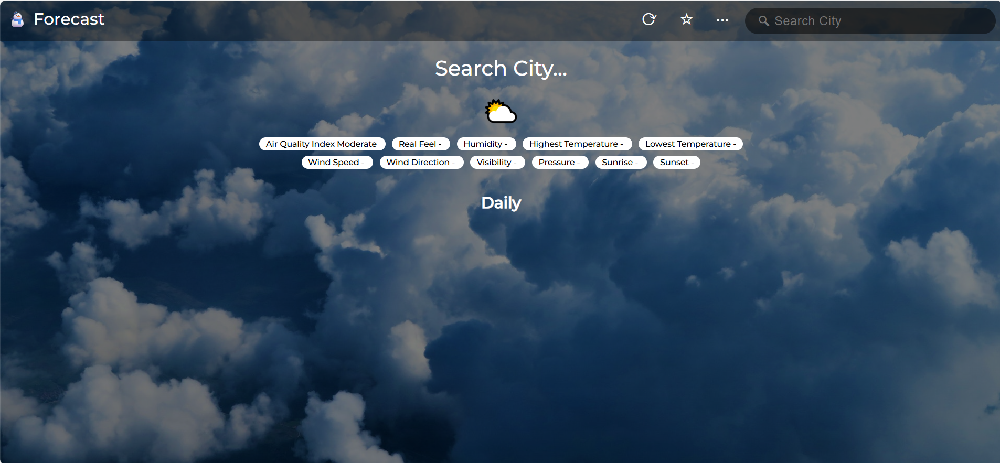
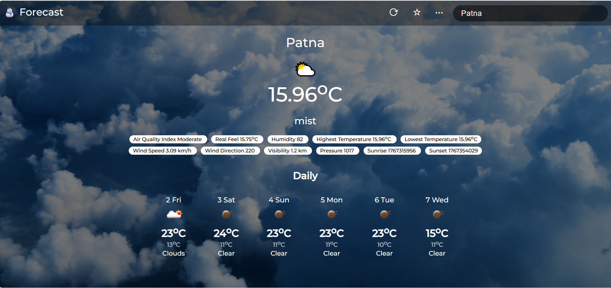

## 🌦 Weather App using OpenWeatherMap API

A responsive and dynamic Weather Forecast Web Application built using HTML, CSS, and JavaScript, which fetches real-time weather data and 6-day forecasts using the OpenWeatherMap API.

---

## 🚀 Features

* 🔍 Search weather by **city name**
* 🌡️ Displays **temperature, humidity, wind speed, and weather condition**
* 📆 Shows **6-day weather forecast**
* ⚡ Fast API response using optimized API calls
* 📱 Responsive design for mobile and desktop

---

## 🛠️ Technologies Used

* **HTML5** – Structure of the application
* **CSS3** – Styling and responsive layout
* **JavaScript (ES6)** – API integration & dynamic content
* **OpenWeatherMap API** – Real-time weather data

---

## 🔑 API Used

* **OpenWeatherMap API**

  * Current Weather API
  * Forecast data processed to display **6 days weather**

---

## 📸 Screenshots

---

## 📌 How It Works

1. User enters a **city name**
2. JavaScript sends a request to **OpenWeatherMap API**
3. API returns weather data in JSON format
4. Data is processed and displayed on the UI
5. Forecast data is filtered to show **6 days weather**

---

## ✅ Future Enhancements

* 🌙 Dark / Light mode
* 📍 Auto-detect location
* 🌧️ Hourly weather forecast
* 🗺️ Map-based weather view

---

## 👩‍💻 Author

**Pooja Kumari**
Computer Science Graduate(B.Tech)
Interested in Web Development & JavaScript-based Projects

